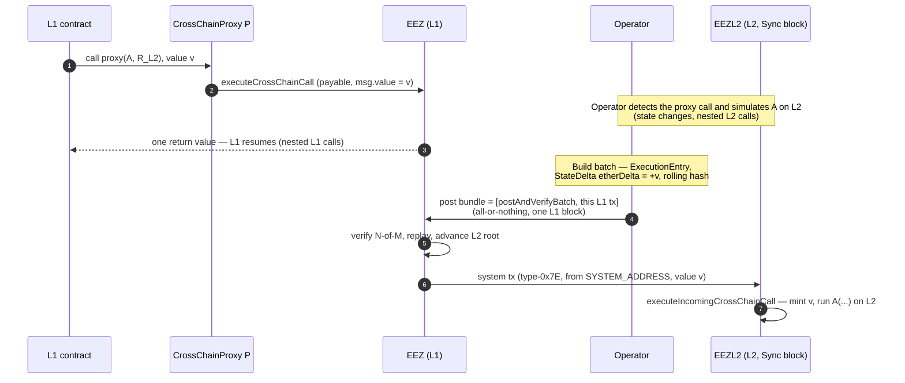

# 9. L1 → L2: The Cross-Chain Flow

This chapter walks one cross-chain interaction end to end. §5 defines the execution *machinery*;
this chapter is the *journey* of a single L1→L2 call — the only cross-chain shape v0 supports.

## 9.1 The v0 interaction

An L1 contract executes (with arbitrary nested L1 calls); at one point it makes **exactly one**
call into L2 (to a cross-chain proxy); the L2 side executes arbitrarily (state changes, nested L2
calls); it returns **one** value; the L1 contract receives that value and resumes (with further
nested L1 calls). The whole interaction settles atomically in one L1 block, or not at all.

`MAINNET_ROLLUP_ID = 0` denotes L1. An inbound call has `sourceRollupId = 0` and `targetRollupId =
R_L2` (the L2's id); the **rollup ids and source address** are taken from proxy identity and
manager context, never from caller input (the `value` and `data` come from the call itself).

## 9.2 The journey

1. **Originate (L1).** The L1 contract calls the proxy `P` for the target `(A, R_L2)`, attaching
   `value` if ETH is delivered. `P` forwards into `EEZ.executeCrossChainCall` (§3.2), which derives
   the call hash from `authorizedProxies[P]` and `msg.value` (§3.3).
2. **Resolve (operator, off-chain).** The operator detects the proxy call, simulates `A` on L2, and
   returns the single result so the L1 execution continues as if local (§6).
3. **Commit (batch).** The result is frozen into an `ExecutionEntry`: one `StateDelta` on `R_L2`
   with `etherDelta = +value`, the return data, and the rolling hash (§5).
4. **Bundle to L1.** `postAndVerifyBatch` and the triggering L1 transaction post as one
   all-or-nothing bundle to the slot's L1 block (§7.4).
5. **Settle (L1).** `EEZ` verifies the N-of-M attestation and applies the entry: the L2 root
   advances and the rollup's ether balance moves by `+value` (§5.4, §8).
6. **Deliver (L2).** In the Sync block, the type-`0x7E` system transaction from `SYSTEM_ADDRESS`
   calls `EEZL2.executeIncomingCrossChainCall`, **mints exactly `value`**, and runs `A` on L2
   (§3.4).

Steps 5 and 6 are bound to the same L1 block (the bundle settles the batch; the Sync block is the
L2 head that batch confirms), so the L1 debit and the L2 credit are atomic (§7.4).

## 9.3 ETH and the deposit-shape entry

The inbound `value` is minted on L2 by the system transaction (`msg.value == value`) and is
accounted on L1 by the entry's `StateDelta.etherDelta = +value` against the rollup's ether balance
(§5.4). The mint is **backed by L1-locked ether**: when the L1 contract makes the call, the attached
`value` is locked on L1 — held by the cross-chain proxy, or routed to a dedicated bridge contract
for use on L2 — and the rollup's on-chain ether balance moves by `+value` to track it. The L2 mint
therefore corresponds to real ether immobilised on L1 for the lifetime of the bridged value; the
custody contract (proxy vs bridge) and the `SYSTEM_ADDRESS` top-up policy are deployment parameters
([Appendix A](A-reference.md)). For a pure deposit the L1 `entries[]` carry a deposit shape (no
return-bearing call); the L2-shape entry travels in the payload's `l2_entries` (§7.1) so followers
can rebuild the system transaction.

## 9.4 Reverts

If the single L2 call reverts, the proxy `.call` returns `(false, returnData)`, captured in the
rolling hash via `CALL_END`; the L1 caller observes the revert and may handle it. The interaction
still settles (the revert is the truthful result); forced-revert handling and reverting cross-chain
*reads* are general-model (§13), not used by the single v0 call.

---

*Next: [§10 Derivation & Following](10-derivation-following.md).*
