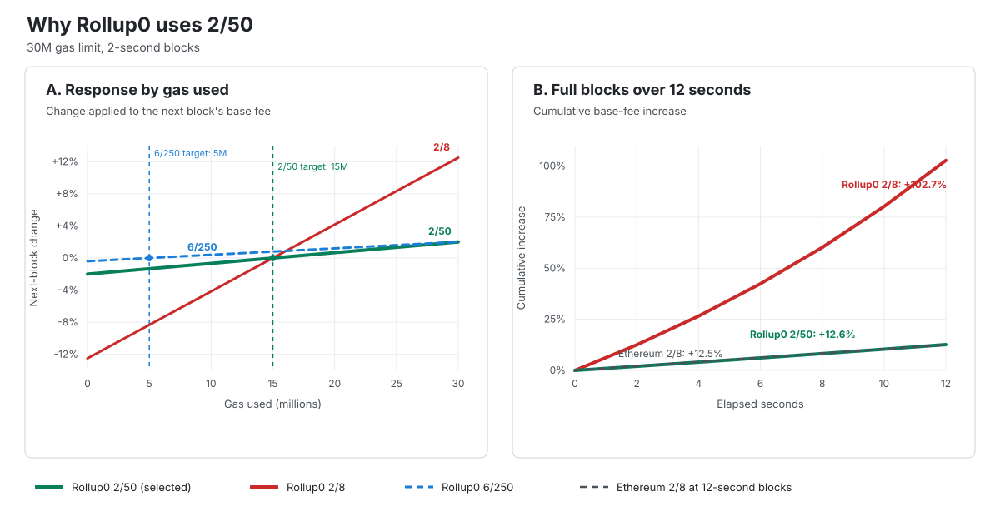

# Appendix B. Gas and Cost Model

This appendix explains the gas rules in Chapter 11 and the reasoning behind them.

## B.1 Base-Fee Parameters

Rollup0 uses a `30,000,000` gas limit, an EIP-1559 elasticity multiplier of `2`, and a
base-fee-change denominator of `50`.

This gives Rollup0:

| Measure | Value |
|---|---:|
| Target gas per 2-second block | `15,000,000` |
| Maximum gas per 2-second block | `30,000,000` |
| Target gas per 12 seconds | `90,000,000` |
| Maximum gas per 12 seconds | `180,000,000` |
| Full-block base-fee increase | `2%` per block |
| Empty-block base-fee decrease | `2%` per block, before integer rounding |

The elasticity multiplier controls burst capacity. A value of `2` lets one block use twice the
sustained target. It avoids treating a much larger burst allowance as normal capacity.

The denominator controls how quickly the base fee changes. Ethereum uses `2/8`, which changes the
base fee by up to `12.5%` once per 12-second block. Applying `2/8` to Rollup0's 2-second blocks
would allow six such changes in the same time. Six consecutive full Rollup0 blocks would raise the
fee by about `102.7%`.

With `2/50`, a full Rollup0 block raises the fee by `2%`. Six consecutive full blocks raise it by
about `12.6%`, close to Ethereum's `12.5%` change over one full 12-second block. Six empty Rollup0
blocks lower it by about `11.4%`.

The earlier `6/250` proposal also raises the fee by `2%` when a `30,000,000` gas block is full.
However, it sets the target to only `5,000,000` gas per block and lowers the fee by only `0.4%`
after an empty block. It therefore combines a six-times burst allowance with much slower fee
decay. Rollup0 instead uses `2/50` to keep the same full-block response while setting a
`15,000,000` gas target and a two-times burst allowance.

[](../assets/rollup0-base-fee-comparison.svg)

The left chart shows the next-block base-fee change at different gas use. The right chart shows
the cumulative increase during twelve seconds of full blocks. The `6/250` curve is omitted from
the right chart because it exactly overlaps `2/50`: both increase by `2%` at the `30,000,000` gas
ceiling. The left chart shows their different targets and behavior below that ceiling.

These parameters do not prove that `90,000,000` target gas per 12 seconds is operationally safe.
The deployment still needs load, execution, proving, and data-availability tests. The fixed
`30,000,000` per-block limit bounds a single two-second burst while those measurements are made.

## B.2 Candidate Cost

A candidate's direct cost is approximately:

```text
Rollup0 execution
+ proof or validation
+ Ethereum blobs
+ Ethereum settlement execution
+ ordered bundle inclusion
+ expected retry cost
```

Open composition exposes each composer to losing-sibling risk. A composer can pay validation and
submission costs even when another valid candidate settles first.

## B.3 Data Availability

For a candidate using `n` blobs, the DA cost is determined by the Ethereum blob base fee and the
blob gas charged per blob:

```text
DA_cost = n * blob_gas_per_blob * blob_base_fee
```

The exact monetary cost also depends on settlement execution gas and any inclusion payment.

## B.4 Settlement Scaling

Settlement cost grows with:

- encoded EEZ batch size;
- number of execution entries and lookups;
- validator/prover threshold and proof-system verification cost;
- state reads and writes;
- trigger execution; and
- bundle inclusion overhead.

Production capacity limits require measurements against the final contracts, proof policy, and
protocol-transaction format. This draft does not provide measured limits.

---

*Next: [Appendix C, Open Questions](C-open-questions.md).*
